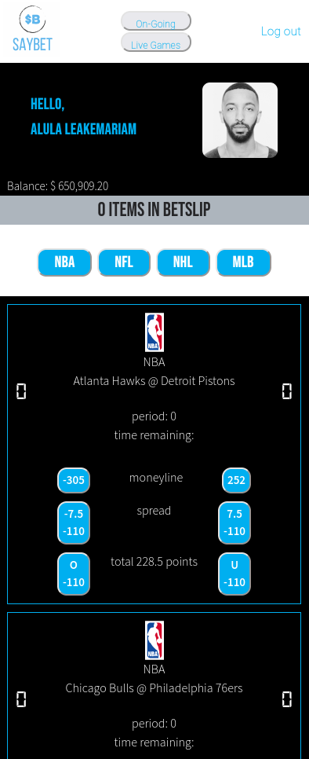

<div id="top"></div>

[![Contributors][contributors-shield]][contributors-url]
[![Forks][forks-shield]][forks-url]
[![Stargazers][stars-shield]][stars-url]
[![Issues][issues-shield]][issues-url]
[![MIT License][license-shield]][license-url]
[![LinkedIn][linkedin-shield]][linkedin-url]

<!-- PROJECT LOGO -->
<br />
<div align="center">
  <a href="./client/public/SayBet-logo.png">
    
  </a>

  <h3 align="center">Best-README-Template</h3>

  <p align="center">
    A live sports wagering app for the NBA, NFL, NHL and MLB.
    <br />
    <br />
    <a href="https://github.com/AlulaLeak/sports-betting-app/issues">Report Bug</a>
     · 
    <a href="https://github.com/AlulaLeak/sports-betting-app/issues">Request Feature</a>
  </p>
</div>
    <br />

<!-- TABLE OF CONTENTS -->
<details>
  <summary>Table of Contents</summary>
  <ol>
    <li>
      <a href="#about-the-project">About The Project</a>
      <ul>
        <li><a href="#built-with">Built With</a></li>
      </ul>
    </li>
    <li>
      <a href="#getting-started">Getting Started</a>
      <ul>
        <li><a href="#prerequisites">Prerequisites</a></li>
        <li><a href="#installation">Installation</a></li>
      </ul>
    </li>
    <li><a href="#usage">Usage</a></li>
    <li><a href="#roadmap">Roadmap</a></li>
    <li><a href="#contributing">Contributing</a></li>
    <li><a href="#license">License</a></li>
    <li><a href="#contact">Contact</a></li>
    <li><a href="#acknowledgments">Acknowledgments</a></li>
  </ol>
</details>

<!-- ABOUT THE PROJECT -->

## About The Project

<div align="center">
    <br />
  <a href="./client/public/saybet-live-games-page.png">
    
  </a>
  </div>
    <br />

The app presents the user along with their picture and their balance as shown above. The user can choose what specific league they want to see the scores and odds for.

As the user picks the game they want to wager on, the API fetches us odds for the 3 styles of bets (moneylines, spreads and parlays) available for each game.

The user can add as many individual bets to a bet-slip as they would like. This now makes it a parlay and can increase a user's winnings!

Also, if the user changes their mind about a game they were about to wager on, they can cancel it.

Early cash out functionality coming soon!

<p align="right">(<a href="#top">back to top</a>)</p>

### Built With

This section should list any major frameworks/libraries used to bootstrap your project. Leave any add-ons/plugins for the acknowledgements section. Here are a few examples.

- [React.js](https://reactjs.org/)
- [Socket.IO](https://socket.io/)
- [Express](https://expressjs.com/)
- [PostgreSQL](https://www.postgresql.org/)

<p align="right">(<a href="#top">back to top</a>)</p>

<!-- GETTING STARTED -->

## Getting Started

### Installation

_Below is an example of how you can instruct your audience on installing and setting up your app. This template doesn't rely on any external dependencies or services._

1. Get a free API Key at [https://rapidapi.com/SportspageFeeds](https://rapidapi.com/SportspageFeeds/api/sportspage-feeds/)
2. Clone the repo
   ```sh
   git clone https://github.com/AlulaLeak/sports-betting-app
   ```
3. Install NPM packages in both client and server folders
   ```sh
   npm install
   ```
4. Enter authentication details into client/.env
   ```
    REACT_APP_AUTH0_DOMAIN=<Auth0-Domain>
    REACT_APP_AUTH0_CLIENT_ID=<Auth0-Client-Id>
   ```
5. Enter authentication details into server/.env
   ```
    DB_HOST=<Database-Host>
    DB_PORT=<Port-Connecting-To-Database>(5432-By-Default)
    DB_USER=<Username-Associated-To-Database>
    DB_PASS=<Of-Your-Database>
    DB_NAME=<Name-Of-Your-Database>
    REACT_APP_X_RAPIDAPI_HOST=sportspage-feeds.p.rapidapi.com
    REACT_APP_X_RAPIDAPI_KEY=<Your-API-Key>
   ```

<p align="right">(<a href="#top">back to top</a>)</p>

<!-- ROADMAP -->

## Roadmap

- [x] Add back to top links
- [ ] Add Early Cash Out Function
- [ ] Multi-language Support
  - [ ] Chinese
  - [ ] Spanish

See the [open issues]("https://github.com/AlulaLeak/sports-betting-app"/issues) for a full list of proposed features (and known issues).

<p align="right">(<a href="#top">back to top</a>)</p>

<!-- CONTRIBUTING -->

## Contributing

Contributions are what make the open source community such an amazing place to learn, inspire, and create. Any contributions you make are **greatly appreciated**.

If you have a suggestion that would make this better, please fork the repo and create a pull request. You can also simply open an issue with the tag "enhancement".
Don't forget to give the project a star! Thanks again!

1. Fork the Project
2. Create your Feature Branch (`git checkout -b feature/AmazingFeature`)
3. Commit your Changes (`git commit -m 'Add some AmazingFeature'`)
4. Push to the Branch (`git push origin feature/AmazingFeature`)
5. Open a Pull Request

<p align="right">(<a href="#top">back to top</a>)</p>

<!-- LICENSE -->

## License

Distributed under the MIT License. See `LICENSE.txt` for more information.

<p align="right">(<a href="#top">back to top</a>)</p>

<!-- CONTACT -->

## Contact

Alula Leakemariam - [LinkedIn](https://www.linkedin.com/in/alula-leakemariam-903059233/) - alula.leakemariam94@gmail.com

Rahwa Leakemariam -

Tatyana F -

Project Link: [https://github.com/AlulaLeak/sports-betting-app]

<p align="right">(<a href="#top">back to top</a>)</p>

<!-- ACKNOWLEDGMENTS -->

## Acknowledgments

- [Img Shields](https://shields.io)
- [GitHub Pages](https://pages.github.com)
- [Font Awesome](https://fontawesome.com)
- [Sportspage-Feeds API](https://rapidapi.com/SportspageFeeds/api/sportspage-feeds/)

<p align="right">(<a href="#top">back to top</a>)</p>

<!-- MARKDOWN LINKS & IMAGES -->
<!-- https://www.markdownguide.org/basic-syntax/#reference-style-links -->

[contributors-shield]: https://img.shields.io/github/contributors/AlulaLeak/sports-betting-app.svg?style=for-the-badge
[contributors-url]: https://github.com/AlulaLeak/sports-betting-app/graphs/contributors
[forks-shield]: https://img.shields.io/github/forks/AlulaLeak/sports-betting-app.svg?style=for-the-badge
[forks-url]: https://github.com/AlulaLeak/sports-betting-app/network/members
[stars-shield]: https://img.shields.io/github/stars/AlulaLeak/sports-betting-app.svg?style=for-the-badge
[stars-url]: https://github.com/AlulaLeak/sports-betting-app/stargazers
[issues-shield]: https://img.shields.io/github/issues/AlulaLeak/sports-betting-app.svg?style=for-the-badge
[issues-url]: https://github.com/AlulaLeak/sports-betting-app/issues
[license-shield]: https://img.shields.io/github/license/AlulaLeak/sports-betting-app.svg?style=for-the-badge
[license-url]: https://github.com/AlulaLeak/sports-betting-app/tree/master/LICENSE.txt
[linkedin-shield]: https://img.shields.io/badge/-LinkedIn-black.svg?style=for-the-badge&logo=linkedin&colorB=555
[linkedin-url]: https://www.linkedin.com/in/alula-leakemariam-903059233/
[product-screenshot]: images/screenshot.png
